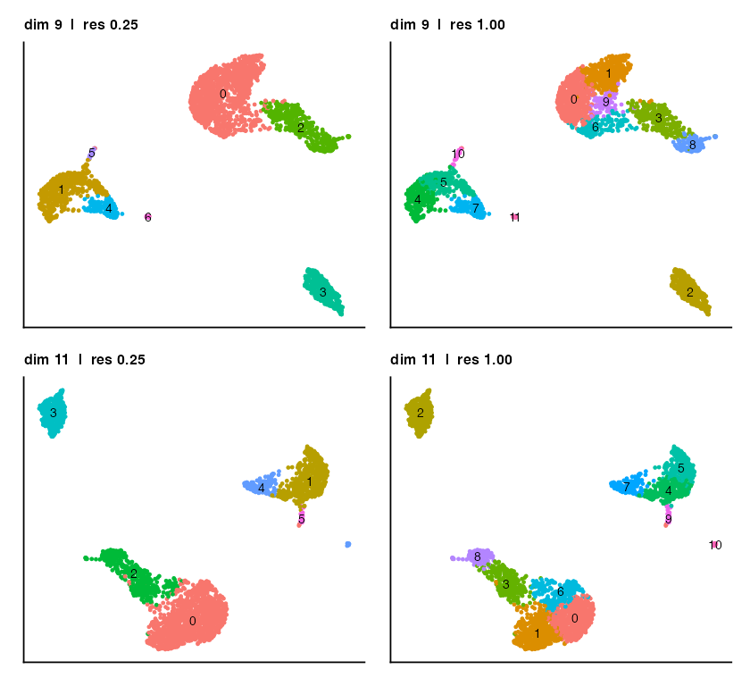
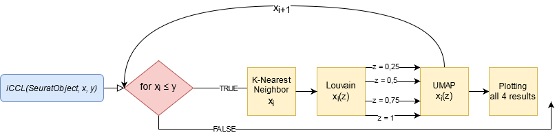
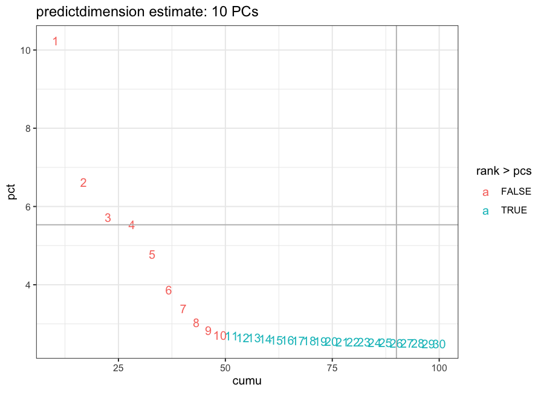
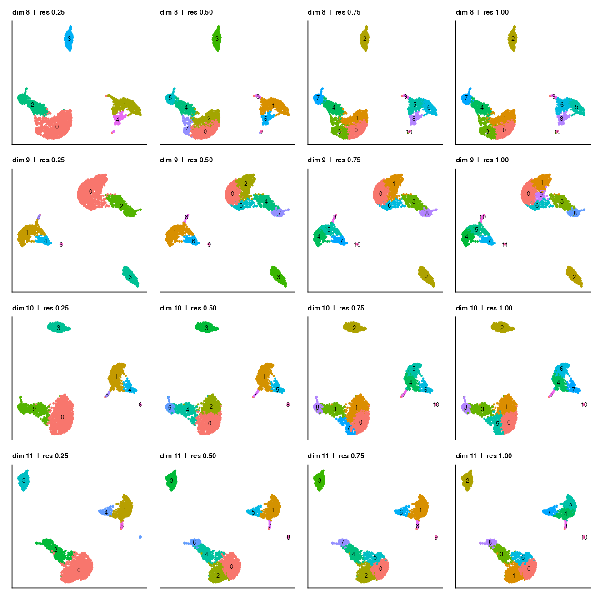
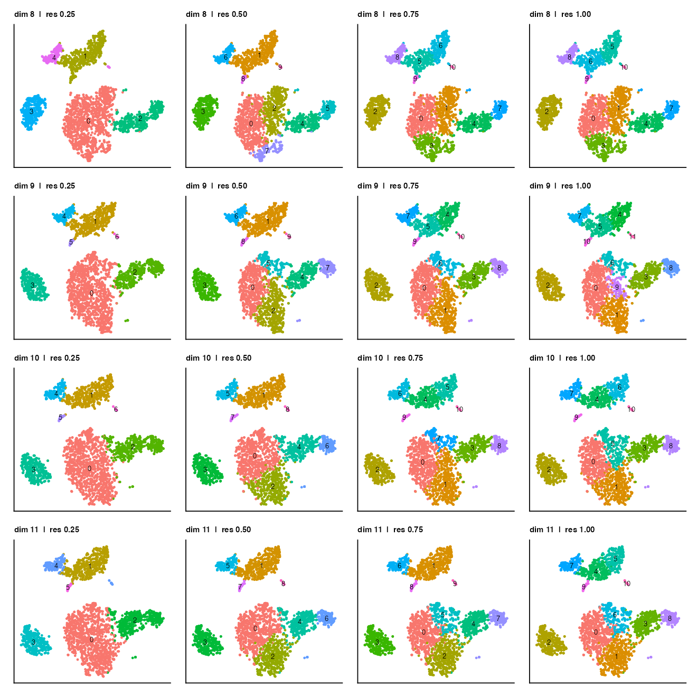
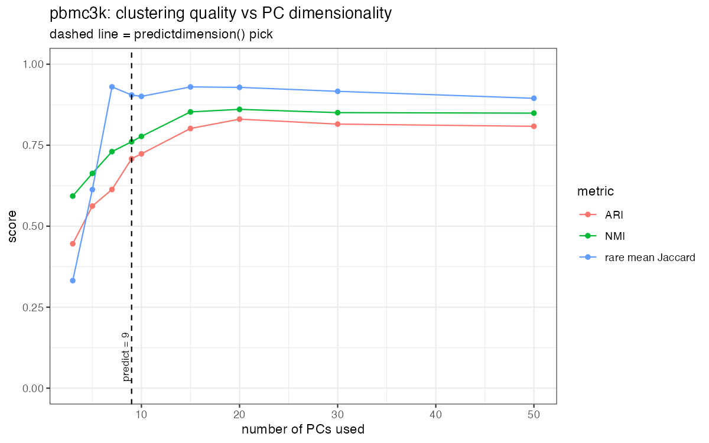

<p align="center">
  
</p>

<h1 align="center">iCCL</h1>

<p align="center">
  <b>interactive Comparative Clustering Loop</b><br/>
  <i>Objective PCA dimensionality &amp; comparative clustering for Seurat</i>
</p>

<p align="center">
  <a href="https://github.com/ari-abb/iCCL/actions/workflows/R-CMD-check.yaml"></a>
  
  
  
</p>

> Stop guessing how many principal components to keep, and stop clustering at a
> single arbitrary resolution. `iCCL` gives you an **objective, reproducible**
> estimate of the dimensionality (`predictdimension()`), then **sweeps** the
> clustering across dimensions and resolutions and lays the results out
> side-by-side as UMAP and/or t-SNE plots (`iCCL()`) so you can pick the
> clustering that makes the most **biological** sense.

`iCCL` is a thin, dependency-light layer on top of standard
[Seurat](https://satijalab.org/seurat/). It changes *nothing* about Seurat's
maths - it removes two sources of guesswork from the workflow.

<p align="center">
  <br/>
  <sub><i>One command turns a dataset into a comparison grid of clusterings across PC dimensions (rows) and resolutions (columns), as UMAP and t-SNE. See <a href="#example-output">Example output</a>.</i></sub>
</p>

---

## Contents

- [Why this exists](#why-this-exists)
- [Where it sits in the Seurat pipeline](#where-it-sits-in-the-seurat-pipeline)
- [The core idea: dimensions are objective, resolution is biological](#the-core-idea-dimensions-are-objective-resolution-is-biological)
- [Installation](#installation)
- [Quick start](#quick-start)
- [Functions at a glance](#functions-at-a-glance)
- [Full worked example (UMAP **and** t-SNE)](#full-worked-example-umap-and-t-sne)
- [Example output](#example-output)
- [Function reference](#function-reference)
- [UMAP vs t-SNE - which to use](#umap-vs-t-sne--which-to-use)
- [How it compares to reading the elbow plot (and to clustree / chooseR)](#how-it-compares)
- [Validation on real data](#validation-on-real-data)
- [FAQ](#faq)
- [Citation & acknowledgements](#citation--acknowledgements)

---

## Why this exists

Two steps in the standard Seurat clustering workflow are left to human judgement:

1. **How many PCs?** Seurat's vignette asks you to look at `ElbowPlot()` and
   pick the point where the curve flattens. This is subjective, hard for
   beginners, irreproducible between analysts, and genuinely ambiguous on
   datasets whose scree plot has no sharp elbow. Choosing too few PCs silently
   **merges away rare cell populations**.

2. **Which clustering resolution?** `FindClusters()` takes a `resolution`
   parameter that controls how finely cells are split. There is no single
   "correct" value - the right granularity depends on the biological question
   and on what the person who generated the data knows about it.

`iCCL` treats these two problems differently, because they *are* different
(see [below](#the-core-idea-dimensions-are-objective-resolution-is-biological)):

- **`predictdimension()`** turns the elbow read into an **objective number**.
- **`iCCL()`** turns the resolution choice into an **informed comparison** by
  generating every candidate for you to inspect.

---

## Where it sits in the Seurat pipeline

`iCCL` plugs into the standard Seurat workflow at the dimensionality-reduction
and clustering stage. Everything upstream and downstream is unchanged; `iCCL`
only replaces the two guesswork steps:

- `ElbowPlot()` (eyeballed) becomes `iCCL::predictdimension()`
- a single blind `FindClusters()` resolution becomes a swept, compared set from `iCCL::iCCL()`

So the full path is: `NormalizeData` -> `FindVariableFeatures` -> `ScaleData` ->
`RunPCA` -> **`predictdimension()`** -> **`iCCL()`** -> pick dims + resolution ->
`DimPlot` -> `FindAllMarkers` -> annotation.

The clustering loop itself, from the original workflow diagram: for each
dimension in the requested range it runs K-nearest-neighbor plus Louvain
clustering at four resolutions, embeds the result (UMAP and/or t-SNE), and
saves every plot for side-by-side comparison.



Everything `iCCL` calls (`FindNeighbors`, `FindClusters`, `RunUMAP`, `RunTSNE`,
`DimPlot`) is plain Seurat, so the objects it produces are ordinary Seurat
objects. Nothing locks you in.

---

## The core idea: dimensions are objective, resolution is biological

This is the design philosophy, and it explains why the two functions behave
differently:

| Choice | Nature of the decision | How `iCCL` handles it |
|---|---|---|
| **Number of PCs** (`dims`) | A largely **technical / statistical** question - how much of the meaningful variance to retain. There is a defensible, quantitative answer. | **Automated.** `predictdimension()` computes it. |
| **Clustering resolution** (`resolution`) | A **biological** question - how finely *should* these cells be split, given what is known about the sample? Only the analyst / data generator can judge this. | **Not automated.** `iCCL()` produces every candidate and hands the decision to you. |

In other words: `iCCL` automates the part that *should* be objective, and
deliberately keeps a human in the loop for the part that *should* be
biological. It does not try to tell you which clustering is "right" - it makes
the trade-offs visible so the domain expert can decide.

---

## Installation

`iCCL` depends only on **Seurat** and **ggplot2** (both on CRAN). t-SNE works
out of the box because Seurat already ships it via `RunTSNE()` - no extra
package needed.

```r
# 1. Seurat (CRAN)
install.packages("Seurat")

# 2. iCCL from GitHub
if (!requireNamespace("remotes", quietly = TRUE)) install.packages("remotes")
remotes::install_github("ari-abb/iCCL")

# (devtools::install_github("ari-abb/iCCL") works too)
library(iCCL)
```

> **Bioconductor note.** `iCCL` itself needs nothing from Bioconductor. If you
> are following the broader single-cell workflow around it (SingleR, PROGENy,
> clusterProfiler, ...), install those with
> `BiocManager::install(c("SingleR", "progeny", "clusterProfiler"))`.
>
> **Reproducing the validation** ([below](#validation-on-real-data)) needs a few
> extra CRAN/GitHub packages:
> `install.packages(c("aricode", "patchwork"))` and
> `remotes::install_github("satijalab/seurat-data")`.

Tested with Seurat 5.x on R >= 4.x (and originally developed against Seurat 4.0).

---

## Quick start

```r
library(Seurat)
library(iCCL)

# ... obj has already been through NormalizeData -> FindVariableFeatures ->
#     ScaleData -> RunPCA ...

pcs <- predictdimension(obj)          # objective PC estimate (draws a plot too)

iCCL(obj, min.dim = pcs - 1, max.dim = pcs + 2,   # sweep a small window
     name = "myproject", reduction = "both")       # UMAP + t-SNE

# -> look through ./iCCL_results_myproject/*.png, pick the dims + resolution
#    that best match the biology, then apply them in one call:
obj <- clusterselect(obj, dims = 9, resolution = 0.8, reduction = "both")
```

---

## Functions at a glance

Three functions, one per step of the workflow:

| function | what it does |
|---|---|
| `predictdimension(obj)` | Objective estimate of how many PCs to use, replacing the eyeballed elbow plot. Returns the number (and draws the diagnostic). |
| `iCCL(obj, min.dim, max.dim, ...)` | Sweeps clustering across a range of PC dimensions x resolutions and saves one UMAP and/or t-SNE plot per combination for comparison. |
| `clusterselect(obj, dims, resolution, ...)` | Applies the dimensions + resolution you chose and returns the object with clusters and embedding(s) stored on it. |

Intended flow: **`predictdimension()` -> `iCCL()` -> `clusterselect()`**. Full
signatures and options are in the [Function reference](#function-reference).

---

## Full worked example (UMAP **and** t-SNE)

Using the 2,700-cell PBMC dataset that ships with Seurat's own tutorial:

```r
library(Seurat)
library(iCCL)

# --- 1. standard Seurat pre-processing (unchanged) ------------------------
pbmc <- CreateSeuratObject(counts = pbmc.counts, project = "pbmc3k")
pbmc <- NormalizeData(pbmc)
pbmc <- FindVariableFeatures(pbmc, selection.method = "vst", nfeatures = 2000)
pbmc <- ScaleData(pbmc, features = rownames(pbmc))
pbmc <- RunPCA(pbmc, features = VariableFeatures(pbmc))

# --- 2. OBJECTIVE dimensionality (replaces reading ElbowPlot by eye) ------
pcs <- predictdimension(pbmc)
#> draws the annotated diagnostic plot and returns e.g. 9
#  (Seurat's vignette picks 10 for this dataset by eye - we land at 9.)

# --- 3. COMPARATIVE clustering sweep, UMAP *and* t-SNE --------------------
# Sweep a small window around the estimate, at four resolutions each.
iCCL(pbmc,
     min.dim     = pcs - 1,          # e.g. 8
     max.dim     = pcs + 2,          # e.g. 11
     name        = "pbmc3k",
     resolutions = c(0.4, 0.8, 1.2), # the *biological* granularity knob
     reduction   = "both")           # "umap", "tsne", or "both"

# -> writes ./iCCL_results_pbmc3k/ :
#     pbmc3k_Dim8_Res0.4_umap.png   pbmc3k_Dim8_Res0.4_tsne.png
#     pbmc3k_Dim8_Res0.8_umap.png   pbmc3k_Dim8_Res0.8_tsne.png
#     ...                           (one plot per dim x resolution x embedding)

# --- 4. inspect the grid, pick what fits the biology ----------------------
# Say Dim9 / Res0.8 cleanly separates the cell types you expect (incl. the
# rare dendritic-cell and platelet populations). Commit to that choice in one
# call: clusterselect() applies the settings and stores them on the object.
pbmc <- clusterselect(pbmc, dims = 9, resolution = 0.8, reduction = "both")

# --- 5. continue downstream exactly as normal ----------------------------
DimPlot(pbmc, reduction = "umap", label = TRUE)
markers <- FindAllMarkers(pbmc, only.pos = TRUE, min.pct = 0.25)
```

The embedding is computed **once per dimension and re-used across
resolutions** (UMAP/t-SNE depend only on the dimensions, not the resolution),
so a sweep of *D* dimensions x *R* resolutions costs *D* embeddings, not
*D x R*.

---

## Example output

Running `predictdimension()` then `iCCL()` on the 2,700-cell PBMC dataset
produces the figures below (generated by
[`validation/run_validation.R`](validation) and stored in
[`man/figures`](man/figures)).

**`predictdimension()`** draws the numbered elbow: each point is a PC, those
kept for clustering are highlighted, and the title reports the estimate.

<p align="center"></p>

**`iCCL()`** produces a comparison grid. Every panel is one clustering: rows are
PC dimensions (8-11), columns are resolutions (0.25 / 0.50 / 0.75 / 1.00). The
same sweep is rendered as UMAP and as t-SNE, so you can judge both the
granularity (across resolutions) and the embedding side by side, then pass your
pick to `clusterselect()`. Notice how the cluster count grows left-to-right with
resolution.

UMAP:



t-SNE:



---

## Function reference

### `predictdimension(SeuratObject, plot = TRUE)`

Objective estimate of how many PCs to use, as a drop-in replacement for reading
`ElbowPlot()` by eye. Ports the heuristic from the
[Harvard Chan Bioinformatics Core](https://hbctraining.github.io/scRNA-seq/lessons/elbow_plot_metric.html):
it takes the **minimum** of

1. the first PC whose **cumulative** variation exceeds 90 % while that PC
   contributes **< 5 %** individually, and
2. the last PC where the **drop** in variation to the next PC is still > 0.1 %.

**Requires** that `RunPCA()` has already been run. **Returns** the estimated
number of PCs (invisibly, as an integer - so it is pipeable), and by default
draws the annotated diagnostic plot (kept PCs vs discarded PCs colour-coded).

> Note: the heuristic normalises variance over the PCs present in the object, so
> the estimate depends slightly on how many were computed. Keep a consistent
> `npcs` (Seurat's default is `RunPCA(npcs = 50)`); on PBMC3k at that default it
> returns 9.

```r
pcs <- predictdimension(obj)            # plot + return
pcs <- predictdimension(obj, plot = FALSE)   # just the number
```

### `iCCL(SeuratObject, min.dim, max.dim, name = "iCCL", resolutions = c(0.25, 0.5, 0.75, 1), reduction = c("umap", "tsne", "both"))`

Sweeps clustering across every combination of dimension (`min.dim`..`max.dim`,
must be >= 3) and `resolutions`, saving one embedding plot per combination into
`./iCCL_results_<name>/`.

| argument | default | meaning |
|---|---|---|
| `min.dim`, `max.dim` | - | inclusive range of PCs to cluster on (>= 3) |
| `name` | `"iCCL"` | label for the output folder and plot titles |
| `resolutions` | `c(0.25, 0.5, 0.75, 1)` | resolutions to sweep - **your biological knob** |
| `reduction` | `"umap"` \| `"tsne"` \| `"both"` | which embedding(s) to render |

Output files are named `` `<name>_Dim<d>_Res<r>_<umap|tsne>.png` `` so they sort
neatly for comparison. Returns the output directory path (invisibly).

### `clusterselect(SeuratObject, dims, resolution, reduction = c("umap", "tsne", "both"))`

Once you have chosen a dimensionality and resolution from the `iCCL()` grid,
`clusterselect()` applies exactly those settings (`FindNeighbors` ->
`FindClusters` -> `RunUMAP`/`RunTSNE`) and returns the updated Seurat object
with the clusters (`Idents` and `seurat_clusters`) and embedding(s) stored on
it. It saves you from re-typing the individual Seurat calls once you've decided.

```r
obj <- clusterselect(obj, dims = 9, resolution = 0.5, reduction = "both")
Seurat::DimPlot(obj, reduction = "umap", label = TRUE)
```

---

## UMAP vs t-SNE - which to use

Both are supported (`reduction = "both"` renders each on identical clusters, so
you can compare them directly):

- **UMAP** - the modern default. Faster, tends to preserve more of the global
  structure (relationships *between* clusters), reproducible embeddings.
- **t-SNE** - older but still widely preferred by many for how tightly it
  separates well-defined clusters locally. Slower and less faithful to global
  distances, but excellent for eyeballing whether a population forms a discrete
  island.

A practical pattern: use UMAP for the final figure, but glance at the t-SNE to
sanity-check that a borderline cluster is genuinely separable.

---

## How it compares

<a name="how-it-compares"></a>

| | reading `ElbowPlot()` | `iCCL::predictdimension()` | `clustree` / `chooseR` |
|---|---|---|---|
| PC count | subjective, per-analyst | **objective, reproducible** | not their focus |
| Resolution | you pick one, blind | **all candidates shown as plots** | `clustree` visualises resolution stability; `chooseR` auto-selects by silhouette |
| Beginner-friendly | no | yes | moderate |
| Learning curve | - | one function call | more setup |

`iCCL` is deliberately lightweight and complementary: it is the fastest way to
get an objective PC count and a visual resolution comparison, then commit to a
choice in three calls. If you later want a *quantitative* resolution score,
`clustree` and `chooseR` are excellent and pair well with this workflow.

---

## Validation on real data

Does `predictdimension()` actually land on a good number of PCs? We checked on
two datasets by sweeping a **grid** of PC counts and measuring clustering-vs-
reference agreement (ARI/NMI) and **rare-population recovery** at each, marking
where `predictdimension()` lands. Full write-up and scripts in
[`validation/`](validation) -> [`validation/RESULTS.md`](validation/RESULTS.md).

**PBMC3k (discrete cell types):** rare populations (dendritic cells, platelets)
collapse at low PC counts and only resolve from ~7 PCs onward.
`predictdimension()` picks **9** - right on the recovery plateau - matching the
Seurat vignette's manual choice of 10, and avoiding the under-selection a
beginner would make.



**bmcite bone marrow (continuous progenitors):** an honest limitation - global
agreement keeps improving with more PCs, and the rare *progenitor* populations
never form discrete clusters at any dimensionality. Here `predictdimension()`
gives a sensible, conservative starting point rather than an optimum.

**Takeaway:** `predictdimension()` is a reproducible, judgement-free PC estimate
that reliably avoids the dangerous low-dimension mistake on datasets with
discrete populations. It is *not* a promise of "better biology than the elbow"
on every dataset - see the write-up for the nuance.

---

## FAQ

**Do I need to install anything for t-SNE?**
No. Seurat already provides `RunTSNE()` (it uses the `Rtsne` package internally,
which Seurat installs for you). `iCCL` just calls it.

**Does `iCCL()` modify my Seurat object?**
No. `iCCL()` reads your object, runs clustering/embeddings on copies, and only
writes PNGs, so your object is untouched. When you have chosen settings, apply
them with `clusterselect()`, which returns a new object carrying the clusters
and the embedding(s).

**Where do the plots go?**
Into `./iCCL_results_<name>/` under your current working directory. Set it with
`setwd()` first if you want them elsewhere.

**My scree plot has no elbow - will this still work?**
That's exactly the case `predictdimension()` is meant for: it gives a defensible
number where eyeballing fails. Validate it against your known biology via the
`iCCL()` sweep.

---

## Citation & acknowledgements

`iCCL` builds directly on **Seurat**
([Hao et al., 2021](https://doi.org/10.1016/j.cell.2021.04.048)) and the
dimensionality heuristic developed by the **Harvard Chan Bioinformatics Core**
([elbow-plot metric](https://hbctraining.github.io/scRNA-seq/lessons/elbow_plot_metric.html)).

If `iCCL` is useful in your work, please also cite Seurat.

Developed by **Arian Abbasi** (abbasi@hhu.de) as part of a BSc thesis, University
of Cologne. Contributions and ideas are very much appreciated - open an
[issue](https://github.com/ari-abb/iCCL/issues) or PR.

*License: MIT.*
