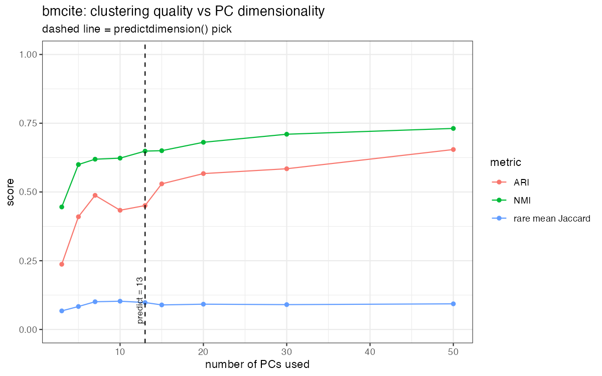

# iCCL validation: `predictdimension()` vs a subjective elbow read

**Question.** Does the quantitative PC estimate from `predictdimension()` land on a
dimensionality that clusters biology as well as, or better than, eyeballing a
Seurat elbow plot?

**Design (deliberately not cherry-picked).** Rather than pick one "bad" elbow
value to beat, we sweep a *grid* of PC dimensions and, at each, measure:

- **ARI / NMI** between the Seurat clustering (resolution 0.8) and the reference
  cell-type annotation - global agreement.
- **Rare-population recovery** = best-matching-cluster Jaccard for the rarest
  annotated cell types - does a rare type get its own cluster, or get merged away?

`predictdimension()`'s pick is marked on every plot. Scripts + raw CSVs are in
this directory; figures in `results/`.

| dataset | cells | reference | `predictdimension()` pick |
|---|---|---|---|
| PBMC3k (Seurat vignette data) | 2,700 | `seurat_annotations` | **9 PCs** (vignette uses 10) |
| bmcite bone-marrow CITE-seq (downsampled) | 10,000 | `celltype.l2` | **13 PCs** |

## PBMC3k - discrete populations: clear win

- Rare populations **collapse at low dimensionality**: at 3 PCs, dendritic cells
  (Jaccard 0.10) and platelets (0.14) are merged into larger clusters. They only
  resolve from **~7 PCs** onward (DC 0.94, Platelet 1.0).
- `predictdimension()` picks **9 PCs - right on the recovery plateau** (DC 0.89,
  Platelet 0.93, rare-mean Jaccard 0.90). A beginner who read the elbow low
  (3-5 PCs) would have lost the dendritic-cell cluster entirely.
- Honest caveat: **global** ARI keeps improving modestly past the pick (0.71 at
  9 PCs -> ~0.83 at 15-20). So predict is a *safe, objective* choice that avoids
  the dangerous under-selection regime - not the ARI-maximising one.

## bmcite - continuous / progenitor populations: honest null

- Global ARI rises **monotonically** with PCs (0.24 at 3 -> 0.65 at 50). Here more
  PCs simply help, and predict's 13 is conservative.
- The rare types tracked are developmental **progenitors** (Prog_B, Prog_Mk,
  CD56-bright NK). Their Jaccard stays low (~0.10) at *every* dimensionality -
  they never form discrete clusters, because they are continua, not islands. No
  dimensionality choice fixes that.
- Caveat: this sweep fixed resolution at 0.8; finer resolution may split some of
  these out - which is exactly what `iCCL()`'s resolution sweep is for.

## Conclusion (what we can honestly claim)

1. `predictdimension()` is a **reproducible, one-shot, judgment-free** PC estimate
   that agrees with the canonical elbow choice on clean data (9 vs the vignette's 10).
2. On datasets with **discrete rare populations** (PBMC3k) it reliably lands on the
   plateau where those populations are resolved, **removing the low-dim mistake** a
   subjective reader can make. That is the defensible win.
3. It is **not** a guarantee of "better biology than the elbow": on complex tissues
   with continuous structure (bone marrow), global agreement favours more PCs and no
   heuristic recovers progenitor continua. The tool's value there is objectivity and
   a sane starting point, not optimality.

This is the honest, dataset-dependent result - stronger than a cherry-picked win,
and it points naturally at the next feature: a per-clustering stability score so the
resolution/dimension sweep can be ranked, not just eyeballed.
